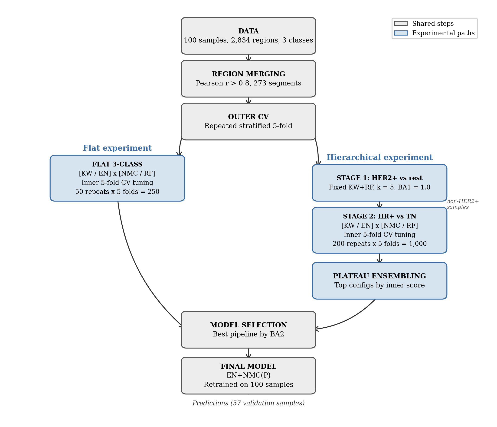
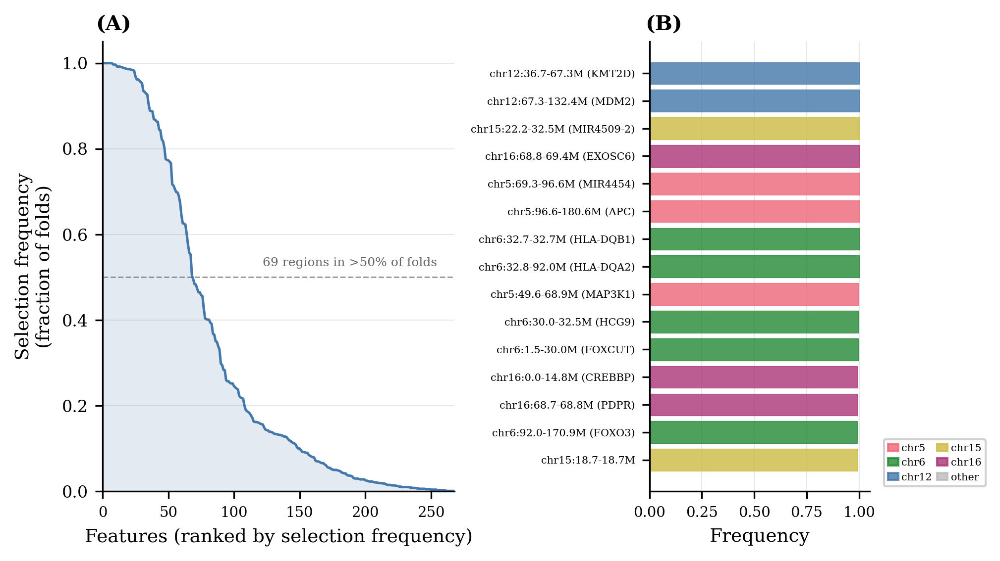
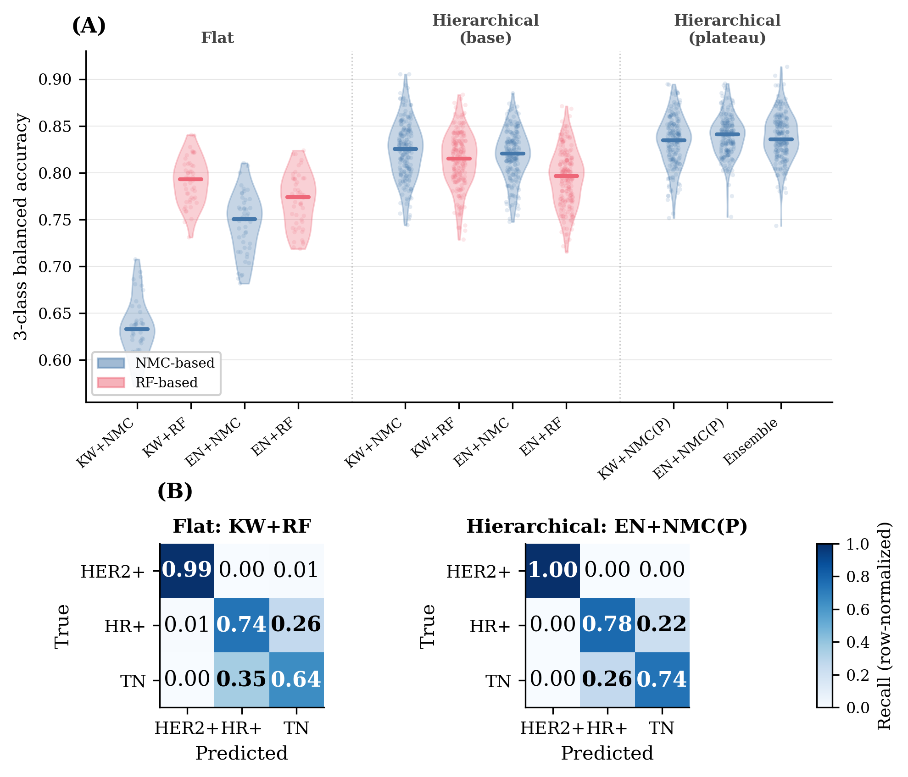

# Hierarchical NMC classifier for breast cancer subtypes from aCGH copy-number data

Predicting three breast cancer molecular subtypes (HER2+, HR+, Triple Negative) from
discrete array-CGH copy-number profiles, with 100 labelled training samples and 57
held-out validation samples whose labels were never released to us.

> **Result:** this classifier placed **first in the cohort for generalisation to the
> unseen validation set, measured in balanced accuracy**, in the Bioinformatics MSc
> research project run jointly by VU Amsterdam and the University of Amsterdam.

The interesting part is not the score. It is that the winning model is a **nearest mean
classifier**, which is about the simplest supervised method that exists: it stores one
centroid per class and assigns each sample to the closer one. It beat random forests,
and it beat elastic-net logistic regression, because three design decisions reshaped the
problem until a simple classifier was the right tool for it.

Those three decisions are the substance of this repository:

| # | Idea | One-line summary |
|---|------|------------------|
| 1 | [Label-free neighbour merging](#1-label-free-neighbour-merging) | Collapse adjacent, redundant genomic regions before any label is touched, cutting 2,834 features to 273 with no leakage. |
| 2 | [Hierarchical decomposition](#2-hierarchical-decomposition) | Split one 3-class problem into a trivial binary problem and a hard binary problem, and the classifier ranking reverses. |
| 3 | [Plateau ensembling](#3-plateau-ensembling-hyperparameter-selection-with-no-extra-cv-layer) | Choose hyperparameters from cross-validation scores that were already computed, without adding a third CV layer. |

---

## Contents

- [The problem](#the-problem)
- [The three ideas](#the-three-ideas)
- [Results](#results)
- [Repository layout](#repository-layout)
- [Reproducing the analysis](#reproducing-the-analysis)
- [Glossary](#glossary)
- [Credits and license](#credits-and-license)

---

## The problem

Array comparative genomic hybridisation (aCGH) measures DNA copy number across the
genome. After segmentation and calling, each tumour is described by a vector of
**discrete ordinal values**: loss (-1), normal (0), gain (+1), amplification (+2).

That gives a dataset with awkward properties:

- **Wide and short.** 2,834 regions, 100 training samples. Roughly 28 features per sample.
- **Discrete.** Four possible values per feature, so the data is full of ties, and
  methods that assume continuous inputs lose their footing.
- **Spatially redundant.** Copy-number changes happen in blocks. Adjacent regions are
  near-copies of each other, with a median Pearson r of 0.92 within 0.1 Mb.
- **Unequal difficulty.** HER2+ tumours carry a huge focal amplification at the ERBB2
  locus on chr17q12. HR+ and Triple Negative tumours do not separate nearly so cleanly.

Wessels et al. (2005) showed that on continuous gene-expression data, simple classifiers
with univariate feature filtering match or beat complex pipelines. The research question
here was whether that still holds on **discrete** copy-number data with **three** classes.

The short answer: it does, but only after the redundancy and the multi-class structure
are dealt with first. Run a flat 3-class comparison and random forest wins outright
(BA 0.791 against 0.631 for nearest mean). Deal with the structure and the ranking flips.

---

## The three ideas

### 1. Label-free neighbour merging

**The problem it solves.** Neighbouring genomic regions are close to duplicates of each
other. That redundancy inflates the feature count, and univariate feature rankings fill
up with twenty variations of the same underlying event. Standard dimensionality reduction
(PCA, feature selection by class separation) would use the labels, and any label-aware
step taken before cross-validation splits leaks test information into training. That is
exactly the selection bias Ambroise and McLachlan (2002) documented.

**What it does.** Walk each chromosome in genomic order. Compare each region to the one
immediately before it with a plain Pearson correlation across samples. If r > 0.8, extend
the current chain; otherwise close the chain and start a new one. Each finished chain
becomes one consensus segment whose value per sample is the **median** copy number of its
constituent regions. Chromosome boundaries always break a chain.

```python
# code/preprocessing_phase.py, the core of merge_regions().
r = np.corrcoef(data[i_prev], data[i_curr])[0, 1]
if np.isnan(r):
    # A region with a constant profile has no defined correlation, so it starts a new chain.
    r = 0.0
if r > MERGE_THRESHOLD:          # MERGE_THRESHOLD = 0.8.
    current_chain.append(i_curr)
else:
    finalise(current_chain)
    current_chain = [i_curr]
```

**Why it is safe.** No label is read anywhere in this step. The grouping depends only on
how the copy-number vectors covary across samples, so running it on the full dataset
before splitting cannot leak class information. The resulting merge map is saved to
`merge_map.json` and replayed onto the 57 validation samples, so training and validation
are described by identical segment boundaries.

**Why it works.**

- 2,834 regions collapse to 273 segments, a 90.4% reduction, and 93 of those segments
  are single unmerged regions that had no correlated neighbour.
- Median adjacent-region correlation falls from 0.925 to 0.590, so the redundancy is
  genuinely gone rather than just re-labelled.
- The signal survives: the top Kruskal-Wallis hit (ERBB2/TCAP on chr17) is still ranked
  first, and cumulative variance in the first 10 principal components roughly doubles
  from 22.3% to 46.0%.
- Skipping the merge costs about 7 percentage points of balanced accuracy
  (p = 0.008, Wilcoxon).
- The threshold is not a knob that needs careful tuning. r = 0.7 and r = 0.9 both land
  within about 2 pp of r = 0.8, and neither difference is significant.

A useful negative result sits next to this one. Merging *further*, up to whole chromosome
arms, destroys the model: Stage 1 balanced accuracy collapses from 1.00 to 0.62, because
averaging across an entire arm dilutes the focal ERBB2 amplicon. The discriminative
signal in these profiles is focal, and region-level resolution is the point at which
redundancy is gone but focality is intact.

### 2. Hierarchical decomposition

**The problem it solves.** In the flat 3-class setup, every pipeline reached high HER2+
recall (0.764 to 0.998) while Triple Negative recall languished between 0.507 and 0.641.
One class was nearly free, another was the entire difficulty, and a single 3-class model
had to serve both with one feature ranking and one set of hyperparameters.

Worse, the easy class was distorting the model comparison. Random forest's apparent
superiority in the flat setting came largely from how well it exploited the ERBB2 signal,
not from any advantage on the part of the problem that was actually hard.

**What it does.** Two stages instead of one.

```
                    all samples, 273 merged segments
                                 |
              Stage 1: HER2+ vs rest, Kruskal-Wallis k=5 + random forest
                             fixed, never tuned
                                 |
                +----------------+----------------+
                |                                 |
            HER2+ (done)              non-HER2+ samples (n = 68)
                                                  |
                     Stage 2: HR+ vs Triple Negative, dedicated feature
                       ranking, full inner-CV hyperparameter tuning
```

**Stage 1 needs no tuning, and that is a finding rather than a shortcut.** Binary
Kruskal-Wallis ranking on HER2+ against everything else puts five chr17q12 features at
the ERBB2 amplicon on top (H = 73.9, p = 9e-17). With those five features, a random
forest reaches **balanced accuracy 1.000 in all 1,000 outer folds**. Inner CV picked
k = 5 over k = 20 unanimously in every fold it was offered the choice.

The routing threshold is likewise **fixed at 0.5 rather than tuned**, and the reason is
instructive. When a binary problem is trivially separable, its ROC curve is a step
function: every threshold in a wide interval achieves identical perfect classification.
Tuning then picks a value from a flat region with no principled basis for the choice,
and earlier runs duly selected thresholds of 0.10 to 0.20 that misrouted about 31 samples
per run with no compensating benefit. The lesson generalises: **do not tune a parameter
the data cannot inform.**

**Stage 2 gets its own feature ranking, and that is where the payoff is.** Ranking
features on HR+ against Triple Negative alone, rather than across all three classes,
surfaces a completely different set. Of the top 30 features under 3-class ranking, 11 sit
on chr17. Under HR+/TN ranking, **zero** chr17 features appear; the list is dominated by
chr12q (23 of 30) and chr5q (7 of 30). Only 13 of 30 overlap. Seventeen features that the
2-class ranking promotes were buried at ranks 31 to 78 by the 3-class ranking, drowned out
by the HER2 signal.

Those regions are not statistical noise. They contain CDK4 and MDM2 on chr12q (cell-cycle
control and p53 antagonism) and PIK3R1 on chr5q (PI3K/AKT signalling), which are known
points of divergence between luminal and basal-like tumours.

**Why it works.** Removing the trivially separable class from Stage 2 reverses the
classifier comparison. Nearest mean now beats random forest by 2.7 pp pooled
(p = 1e-16, Wilcoxon), where in the flat setting it had lost by 16 pp. With 68 samples in
273 dimensions, a random forest's flexible boundaries overfit, while a centroid gives a
stable linear separator. It also happens to mirror clinical practice, where HER2 status is
established first and hormone-receptor status is assessed afterwards.

### 3. Plateau ensembling: hyperparameter selection with no extra CV layer

This is the subtlest of the three, and the one worth reading the code for.

**The problem it solves.** Nested cross-validation tunes hyperparameters in an inner loop
and estimates generalisation in an outer loop. For the elastic-net pipeline the inner grid
has **800 configurations**, and each inner fold holds roughly **11 samples**. Eleven
samples cannot rank 800 configurations. The diagnostics say so plainly:

- **303 distinct configurations** were selected as the single inner-CV best across 1,000
  outer folds. Selection is close to random within a broad plateau of near-equal scores.
- The correlation between a configuration's inner-CV score and its performance on the
  outer test fold is **r = -0.378**. Negative. Picking the inner-CV winner was actively
  worse than picking arbitrarily.
- The inner-CV optimism gap for the single-best selection is +0.084.

The obvious fix is to add another cross-validation layer to select hyperparameters more
stably. That is expensive, and with 100 samples there is no data left to spend on a third
split.

**What it does instead: reuse inner-CV scores that were already computed and written to
disk.** Every ordinary `GridSearchCV` run already produces `cv_results_`, a full table of
mean scores for every configuration. The runner saves that table per outer fold per
repeat, as `fold_details/<pipeline>/r<repeat>/fold<n>_inner_cv.csv`. Across a 50-repeat
run of the base pipeline that is 250 independent estimates of every configuration's
score, sitting unused on disk. Standard nested CV throws all of it away except the argmax
of each individual fold.

Plateau ensembling reads it back:

```python
# code/hierarchical_nested_cv_runner.py, compute_pooled_plateau().
# Every inner-CV score table already written by the base pipeline's GridSearchCV runs.
csv_files = sorted(run_dir.glob(f"*/fold_details/{base_pipeline_name}/r*/fold*_inner_cv.csv"))
# Stack one row of mean_test_score per (repeat, outer fold) into a score matrix.
pooled_mean = score_matrix.mean(axis=0)
pooled_std = score_matrix.std(axis=0)
# Keep every configuration statistically indistinguishable from the best one.
best_idx = int(np.argmax(pooled_mean))
threshold = pooled_mean[best_idx] - pooled_std[best_idx]
plateau = np.where(pooled_mean >= threshold)[0]          # Ranked by pooled score,
plateau = plateau[:MAX_PLATEAU_SIZE]                     # capped at 15 members.
```

The 250 noisy estimates average into one stable estimate per configuration. Rather than
picking a single winner from that ranking, every configuration within one pooled standard
deviation of the best is retained, capped at 15 members. Each member is then **refit from
scratch on the current outer fold's training split only**, and their predicted class
probabilities are averaged.

**Why this is not leakage, and how that was checked.** The concern is real and worth
stating rather than glossing over: pooled scores are computed across all folds and
repeats, so a sample held out in one fold contributed to inner-CV scores in others.
Three properties contain it.

1. Plateau membership is computed **once, before the outer loop**, and is identical for
   every fold. It is a fixed list of hyperparameter values, not a fitted model, and it
   carries no per-sample information.
2. Every plateau member is refit on that outer fold's training split alone. No fitted
   parameter ever crosses a fold boundary.
3. It was measured directly. **Leave-one-repeat-out analysis: on average fewer than 1 of
   15 members changes when any single repeat is dropped** (14.9 of 15 match the full
   plateau). Membership is a property of the hyperparameter grid, not of any particular
   fold's composition.

Decomposing the 3 pp gain gives roughly 0 pp leakage, about 2 pp hyperparameter
stabilisation, and about 1 pp ensemble averaging.

**Why it works, including where it does not.** The gain scales with how badly the inner CV
was struggling in the first place:

| Pipeline | Grid size | Base BA2 | Plateau BA2 | Gain |
|----------|-----------|----------|-------------|------|
| EN + NMC | 800 | 0.729 | **0.759** | **+3.0 pp** |
| KW + NMC | 32 | 0.736 | 0.750 | +1.4 pp |
| Standalone EN | 800 | 0.738 | 0.741 | +0.3 pp |

Two things fall out of that table. Large grids benefit most, which is exactly the
prediction if the mechanism is rescue from inner-CV underfitting: a 32-configuration grid
was never that unstable to begin with. And the classifier matters as much as the grid.
Standalone elastic net sees the same 800 configurations and gains almost nothing, because
regularised logistic regression converges to similar decision boundaries across
neighbouring hyperparameters, so averaging adds no diversity. Each nearest-mean plateau
member, by contrast, selects a different feature subset and therefore places its centroids
in a **different subspace**. Averaging them is closer to random subspace ensembling: it
turns one centroid classifier into a multi-view ensemble.

The ensemble is also deliberately small. Growing it from 15 to 50 members changed 4 of 57
validation predictions, all on samples whose Stage 2 probability sat within 3.2% of 0.5,
and it pushed those borderline cases *closer* to 0.5 rather than sharpening them. The
extra members are lower-ranked configurations that dilute the signal, so 15 stands.

---

## Results

Hierarchical nested cross-validation, 200 repeats x 5 outer folds = 1,000 evaluations.
BA is 3-class balanced accuracy; BA2 is balanced accuracy on the Stage 2 (HR+ vs Triple
Negative) problem only. `(P)` marks plateau ensembling. Stage 1 balanced accuracy is
1.000 for every hierarchical pipeline.

| Experiment | Pipeline | BA | BA2 | HER2+ | HR+ | TN |
|---|---|---|---|---|---|---|
| Flat 3-class | KW + NMC | 0.631 | - | 0.764 | 0.623 | 0.507 |
| Flat 3-class | KW + RF | 0.791 | - | 0.994 | 0.736 | 0.641 |
| Flat 3-class | EN + NMC | 0.746 | - | 0.909 | 0.698 | 0.630 |
| Flat 3-class | EN + RF | 0.770 | - | 0.998 | 0.696 | 0.616 |
| Hierarchical | KW + NMC | 0.824 | 0.736 | 1.000 | 0.760 | 0.712 |
| Hierarchical | KW + RF | 0.814 | 0.721 | 1.000 | 0.748 | 0.692 |
| Hierarchical | EN + NMC | 0.819 | 0.729 | 1.000 | 0.729 | 0.730 |
| Hierarchical | EN + RF | 0.794 | 0.691 | 1.000 | 0.726 | 0.655 |
| Hierarchical | KW + NMC (P) | 0.834 | 0.750 | 1.000 | 0.773 | 0.727 |
| **Hierarchical** | **EN + NMC (P)** | **0.840** | **0.759** | **1.000** | **0.777** | **0.741** |

Every hierarchical variant beats the best flat pipeline. Nearest mean beats random forest
across Stage 2 by 2.7 pp pooled (p = 1e-16, Wilcoxon), reversing the flat result. The
feature selector matters much less than the classifier: KW against EN with nearest mean
comes out at p = 0.055, not significant.

**Honest caveats.**

- The Nadeau-Bengio corrected t-test, which accounts for the non-independence of repeated
  CV folds, finds **no** significant pairwise differences. It is conservative by design
  for this setting. Bootstrap confidence intervals distinguish 38 of 45 pairs, and the
  NMC-versus-RF gap is the one that holds up under both.
- Combined 3-class BA is flattered by Stage 1 being perfect. BA2 is the honest metric for
  comparing hierarchical pipelines against each other, and flat BA against combined BA is
  the fair cross-experiment comparison.
- Performance is at a **data-limited ceiling**, not a model-limited one. Ten samples are
  misclassified in over 80% of evaluations by every single pipeline variant, and no
  Kruskal-Wallis feature at any significance level separates the hard samples from the
  easy ones. Excluding three suspected mislabels lifts BA2 by 3.0 to 3.4 pp uniformly
  across all pipelines, which is the signature of label noise rather than classifier
  weakness.

The submitted model predicted 57 unlabelled validation samples, with an expected 47 to 48
correct from per-class recall weighted by training class proportions. The submitted
predictions are in [`results/prediction.txt`](results/prediction.txt).

### Figures

| | |
|---|---|
|  |  |
| **Nested CV workflow.** Grey boxes are shared preprocessing; blue boxes are the paths that vary per pipeline. | **Stage 2 feature stability.** Selection frequency across 1,000 outer folds; 69 regions exceed 50%. Chr12 and chr5 dominate, distinct from the chr17 signal driving Stage 1. |



**Model comparison.** Left: balanced accuracy across outer CV repeats, blue for
nearest-mean pipelines and red for random-forest pipelines. Right: row-normalised
confusion matrices for the best flat pipeline against the final hierarchical one. The
Triple Negative recall gap, 0.64 against 0.74, is where the hierarchical decomposition
pays off.

---

## Repository layout

```
code/                     All analysis scripts and shared utilities.
  preprocessing_phase.py    Idea 1: label-free neighbour merging.
  hierarchical_nested_cv_runner.py
                            Ideas 2 and 3: two-stage CV and compute_pooled_plateau().
  select_stage1_params.py   Evidence that Stage 1 needs k=5 and no tuning.
  final_training.py         Refit on all 100 samples, predict the 57 validation samples.
  utils/                    Feature selectors, CV plumbing, paths, plotting, statistics.
configs/                  YAML run configs for laptop and cluster.
docs/                     Phase documentation, pre-registration, figure glossary.
paper/                    Final report PDF, slides, and the LaTeX source with figures.
results/                  Summary tables and figures from the two headline runs.
model/run_model.py        Loads the trained model and writes predictions.
tests/                    Unit tests for the configuration, path and logging utilities.
GLOSSARY.md               Every term, metric and pipeline code used here.
CITATIONS.yaml            Bibliography in structured form.
```

Two runs are kept in `results/`:

- `2026-04-25_final_hierarchical/` is the headline 200-repeat run, with exploratory data
  analysis before and after merging, the merge diagnostics, and the full statistical
  comparison (Wilcoxon, Nadeau-Bengio, bootstrap CIs, hard-sample analysis).
- `2026-05-10_pens_plateau_comparison/` is the plateau-size sensitivity study.

Raw per-fold artefacts (roughly 18,000 files and 90 MB of `GridSearchCV` score tables)
were removed from the working tree to keep the repository navigable. They remain in git
history and are regenerated by rerunning the pipeline. Summary tables and every figure
are kept.

## Going deeper

Three files are worth opening if the ideas above were interesting:

- [`interesting_results/findings.md`](interesting_results/findings.md) is the running log
  of results, including the ones that did not work. The Stage 1 threshold artefact, the
  two failed feature-engineering attempts, the plateau-size sensitivity study and the
  hard-sample ceiling analysis are all written up there with their evidence.
- [`docs/pre_registration_v2.md`](docs/pre_registration_v2.md) fixes the hypotheses,
  the comparisons and the significance tests **before** the final run, which is why the
  Nadeau-Bengio result above is reported as a null rather than quietly dropped.
- [`docs/figure_glossary.md`](docs/figure_glossary.md) pins down exactly what each metric
  means and which pipeline label refers to what, since BA, BA1, BA2 and flat BA are easy
  to confuse.

## Reproducing the analysis

The input data is course-provided and not redistributed here, so this section documents
the pipeline rather than offering a one-command reproduction.

```bash
# Create and activate the environment.
conda env create -f environment.yml
conda activate tb_310

# Phases 0 and 1: exploration, neighbour merging, and raw-versus-merged comparison.
python3 code/run_full_workflow.py --name my_experiment

# Phase 2: hierarchical nested CV. Use configs/local.yaml for a 3-repeat smoke test
# and configs/server.yaml for the full 200-repeat run.
bash code/submit_hierarchical_nested_cv.sh

# Analyse the results and regenerate every figure and statistical table.
python3 code/analyse_nested_cv.py --name my_experiment

# Refit on all 100 training samples and predict the 57 validation samples.
python3 code/final_training.py
```

Run the tests with `make test` or `pytest tests/`. They cover the configuration, path and
logging utilities; the method code itself is validated through the cross-validation
diagnostics rather than unit tests.

## Glossary

[`GLOSSARY.md`](GLOSSARY.md) is the single source of truth for terminology. The
abbreviations that appear most often:

| Term | Meaning |
|------|---------|
| **aCGH** | Array comparative genomic hybridisation, the copy-number assay. |
| **BA** | Balanced accuracy, the mean of per-class recalls. |
| **BA1 / BA2** | Balanced accuracy of Stage 1 (HER2+ vs rest) and Stage 2 (HR+ vs TN). |
| **NMC** | Nearest mean classifier, which assigns a sample to the closest class centroid. |
| **KW** | Kruskal-Wallis, the univariate feature filter. |
| **EN** | Elastic Net, the multivariate feature selector. |
| **RF** | Random Forest. |
| **HR+ / TN** | Hormone receptor positive, and Triple Negative. |
| **Plateau ensemble** | The set of hyperparameter configurations within one pooled SD of the best pooled inner-CV score, whose predictions are averaged. |
| **Region merging** | The label-free collapse of adjacent correlated regions into consensus segments. |

A note on naming that trips people up: in the hierarchical experiment, a pipeline label
such as `EN+NMC` refers to **Stage 2 only**. Stage 1 is always the fixed
Kruskal-Wallis + random forest model with k = 5.

## Credits and license

Group project for the Bioinformatics for Translational Medicine research project, MSc
Bioinformatics and Systems Biology, VU Amsterdam and University of Amsterdam.

| Author | Contribution |
|--------|--------------|
| **Christos Botos** | Exploratory data analysis, region merging, hierarchical nested CV, plateau ensembling, cluster infrastructure. |
| **Antonie Wagner** | Flat nested CV (KW+NMC, KW+RF), research question conceptualisation. |
| **Alexandros Michailidis** | Flat nested CV (EN+NMC, EN+RF), standalone elastic net. |
| **Yan Qiao** | Final model training, accuracy estimation. |

All four authors contributed to the intellectual design and the writing of the report.
The three ideas documented above were developed and implemented by Christos Botos, which
is why this repository is presented from that angle; the flat 2x2 baseline that motivated
them was the work of the other three authors, and the comparison is meaningless without it.

Key references: Wessels et al. (2005) for the protocol and the simple-classifier
principle; van de Wiel and van Wieringen (2007) for the CGHregions approach that
motivated label-free merging; Ambroise and McLachlan (2002) for the selection-bias
argument that constrains where preprocessing may sit; Nadeau and Bengio (2003) for the
corrected significance test. Full entries are in [`CITATIONS.yaml`](CITATIONS.yaml) and
`paper/latex_source/references.bib`.

The **code** in this repository is released under the MIT License, see
[`LICENSE`](LICENSE). The report, slides and figures under `paper/` are the academic work
of all four authors and are shared for reference, not under the code license. The input
dataset is course-provided and is not redistributed here.
